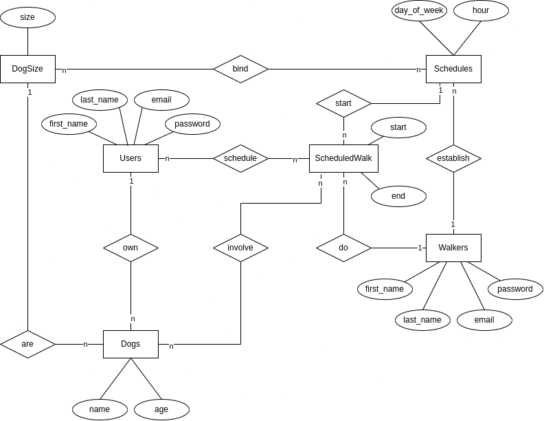

# Documentación del proceso de desarrollo del Server

## Análisis

El proyecto de django ya cuenta con una app registrada (dogger), la cual contiene modelos, serializers, vistas y rutas ya configuradas.

### Funcionamiento del código existente

El primer intento de realizar las migraciones iniciales del proyecto de Django resultó fallido. El output indicaba que faltaban modelos a declarar en el archivo de modelos de la app de dogger.

### Metodología de desarrollo

Debido a la naturalidad de la arquitectura de Django y las dependencias entre archivos, el orden en el que se desarrollan las funcionalidades del servidor es:
```
Modelo -> Serializer -> Vista -> Ruta
```

Se optó por desarrollar todos los modelos antes de enfocarse en las vistas del servidor. Después de esto, los serializers, vistas y rutas se pueden desarrollar y testear por funcionalidad, aprovechando que la lista de funcionalidades mínimas fue proporcionada.

## Diseño

### Diagrama de la base de datos

Modelos consideradas: Dogs, DogSize, Schedules, Walker, Users, ScheduledWalks
Modelos proporcionados: Dogs, DogSize, Schedules



El modelo provisto de Schedules indica una relación uno-a-muchos entre el tamaño de perro y la agenda. Sin embargo, en las funcionalidades minimas se especifica que en un horario se pueden atender a una combinacion de tamaños diferentes de perros, por lo que se optó por usar una relación muchos-a-muchos.

En la implementación de los modelos, se decidió mezclar los modelos de Users y Walker, debido a las siguientes razones:
- Ambas entidades comparten los mismos atributos, por lo que se puede decir que heredan de la misma entidad en un diagrama ER extendido
- Se puede configuar la app de Django para que use el model Users para el middleware de autenticación, con lo que facilitamos la autenticación de peticiones